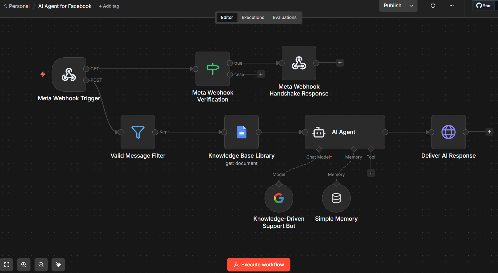
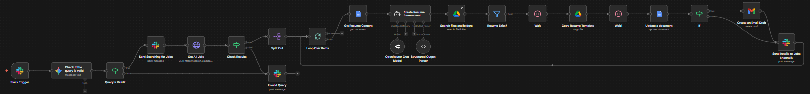
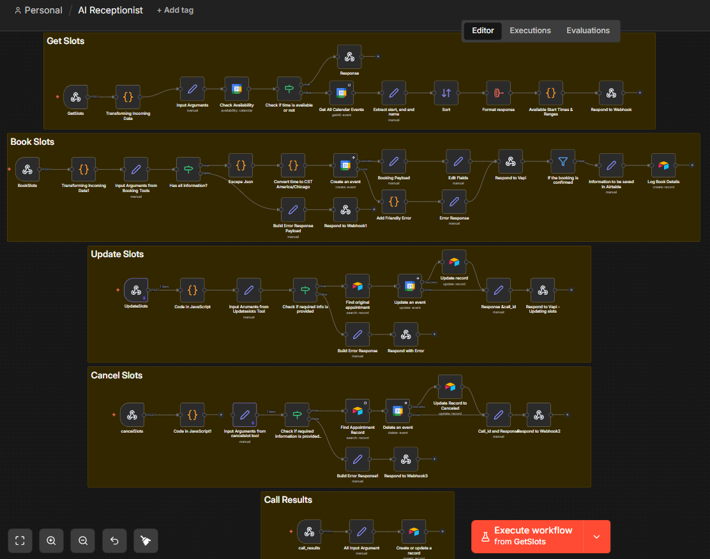
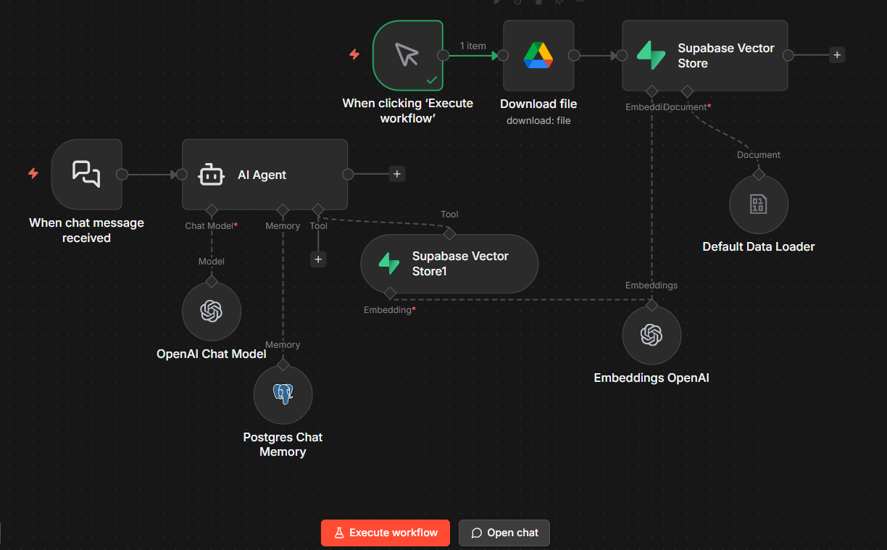

# n8n Automation Portfolio
This repository contains my n8n automation projects built to streamline workflows, eliminate repetitive tasks, and connect multiple platforms into scalable, efficient systems. These projects showcase real-world automation solutions including API integrations, webhook-based architectures, AI-powered workflows, database automation, and business productivity systems. Each workflow demonstrates practical implementation of event-driven automation, custom JavaScript logic, third-party integrations, and intelligent process orchestration using n8n.

---

## 📂 Project Navigation

- [Project 1: AI-Powered Customer Support](#project-1-ai-agent-for-facebook)
- [Project 2: AI Job Search & Resume Optimizer](#project-2-ai-jobs-scraper-and-resume-optimizer)
- [Project 3: AI Receptionist & Appointment Automation](#project-3-ai-receptionist)
- [Project 4: AI Knowledge Base RAG Agent with Vector Search](#project-4-ai-knowledge-base-rag-agent-with-vector-search)
---

## Projects

### Project 1: AI Agent for Facebook
This n8n workflow automates client or possible leads support using an AI-powered agent integrated with Meta (Facebook) Messenger. When a customer sends a message, the system verifies the webhook, filters valid inquiries, and routes the request to an AI Agent. The AI Agent analyzes the query and generates accurate responses based on a connected Knowledge Base Library, ensuring answers are consistent and information-driven. Conversation memory is used to maintain context for a smoother interaction.Once generated, the response is automatically delivered back to the client in real time — creating a fully automated, intelligent customer support system.

### Full Workflow Overview

#### What I Did
- Built an AI-powered auto-reply workflow in n8n triggered by incoming Meta (Facebook) messages  
- Implemented webhook verification and message validation logic  
- Connected a Knowledge Base Library for accurate, information-based responses  
- Configured an AI Agent with memory to maintain conversation context  
- Automated real-time response delivery back to clients  

#### Tools & Integrations
- n8n  
- Meta (Facebook) Webhook  
- AI Agent (LLM Integration)  
- Knowledge Base Library  
- Simple Memory Module  

#### Business Value / Impact
- Provides instant, automated customer support  
- Ensures consistent answers based on approved knowledge base  
- Reduces manual response workload  
- Improves response time and client experience  
- Scalable support system without increasing manpower  

---
 

### Project 2: AI Jobs Scraper and Resume Optimizer
This n8n workflow automates job searching and resume customization using Slack and AI. When a job query is sent through Slack, the system first validates the request using AI (Gemini) to ensure it’s clear and relevant. Once confirmed, it automatically searches for matching job opportunities. For each valid job found, the workflow analyzes the job description and intelligently updates the resume to match the role. The resume is optimized in an ATS-friendly format, saved, and prepared for submission — creating a streamlined, AI-powered job application assistant that reduces manual effort and improves application quality.

### Full Workflow Overview

#### What I Did
- Built an AI-driven job search automation triggered via Slack  
- Implemented AI validation to filter and confirm valid job queries  
- Automated job research based on approved search criteria  
- Analyzed job descriptions to tailor resumes per role  
- Generated and saved ATS-optimized resumes ready for submission  

#### Tools & Integrations
- n8n  
- Slack  
- Google Gemini (LLM)  
- Document Generator / Resume Template  
- Structured Output Parser  

#### Business Value / Impact
- Automates job searching and resume customization  
- Ensures resumes are aligned with specific job descriptions  
- Improves ATS compatibility and application quality  
- Reduces manual editing time  
- Creates a scalable, AI-powered job application assistant  

---
 

### Project 3: AI Receptionist
This n8n workflow powers an AI Receptionist integrated with Vapi to fully automate appointment management. When a client interacts with the AI assistant, the system checks real-time availability and presents open time slots. Once the client confirms, the workflow automatically books the appointment. It can also update or cancel existing bookings upon request. All client details, schedules, and appointment statuses are recorded and managed in Airtable for entralized tracking. By combining Vapi, n8n, and Airtable, this solution creates a smart, voice-enabled scheduling system that reduces manual coordination, prevents double bookings, and improves overall customer experience.

### Full Workflow Overview

#### What I Did
- Built a voice-enabled AI receptionist integrated with Vapi  
- Automated real-time availability checking (Get Slots)  
- Implemented automated appointment booking upon client confirmation  
- Enabled appointment updates and cancellations via AI interaction  
- Stored and managed client details, schedules, and statuses in Airtable  

#### Tools & Integrations
- n8n  
- Vapi (Voice AI Assistant)  
- Airtable  
- Webhooks  
- Custom JavaScript (Data Transformation & Validation)

#### Business Value / Impact
- Automates end-to-end appointment scheduling  
- Reduces manual coordination and front-desk workload  
- Prevents double bookings with real-time availability checks  
- Centralizes client and appointment data in Airtable  
- Enhances customer experience with 24/7 AI voice support

---
 

### Project 4: AI Knowledge Base RAG Agent with Vector Search
This n8n workflow creates an AI-powered assistant that can answer questions using a custom knowledge base. Instead of relying only on the language model’s general knowledge, the system retrieves relevant information from stored documents using vector search. This ensures responses are grounded in real data and reduces hallucinations.
When a user sends a message through the chat interface, the system processes the query using an AI agent powered by a large language model. The agent converts the query into embeddings and searches for relevant documents stored in a vector database. These documents are then used as context for the AI model to generate accurate and context-aware answers.
The workflow also includes a document ingestion pipeline that downloads files, processes them, converts them into embeddings, and stores them in the vector database. This allows the assistant to continuously expand its knowledge base.

#### Full Workflow Overview

#### What I Did
- Built a **Retrieval-Augmented Generation (RAG) AI assistant**
- Designed a **document ingestion pipeline** to process and embed knowledge base documents
- Implemented **semantic vector search** for document retrieval
- Connected an **AI agent** to dynamically retrieve relevant knowledge before generating responses
- Integrated **conversational memory** to maintain context during chat sessions
- Created a **scalable architecture** for expanding the knowledge base with new documents

#### Tools & Integrations
- **n8n** – Workflow automation and orchestration  
- **Supabase** – Vector database for storing embeddings  
- **pgvector** – PostgreSQL extension for vector similarity search  
- **OpenAI** – Chat model and embedding generation  
- **Google Drive** – Document storage and ingestion source  
- **PostgreSQL** – Chat memory storage for conversation context

## Business Value / Impact
- Creates an **AI-powered knowledge assistant** capable of answering questions using internal documents  
- **Reduces time spent searching** through documentation and knowledge bases  
- **Improves response accuracy** by grounding answers in retrieved data  
- Enables **scalable knowledge ingestion** as new documents are added  
- Provides a foundation for **enterprise AI assistants, helpdesk bots, or internal documentation tools**

---

## Portfolio Summary

This repository showcases a collection of automation workflows built using n8n to streamline processes, reduce manual work, and connect multiple platforms into intelligent, efficient systems.

The projects include AI-powered customer support, automated job search and resume optimization, voice-enabled appointment scheduling, API integrations, document automation, and data-driven workflows. Each solution demonstrates my approach to building scalable, reliable, and business-focused automation systems designed to solve real operational challenges.

As automation and AI technologies continue to evolve, this portfolio will expand to include more advanced workflows, integrations, and intelligent systems across various industries and use cases.

---

If you would like to collaborate or discuss automation solutions:

- LinkedIn: [[LinkedIN_Link](https://www.linkedin.com/in/jarolf-eunel-carrasco-092038136 )]
- Email: [jarolfcarrasco@gmail.com]

---

Thank you for visiting my automation portfolio.
